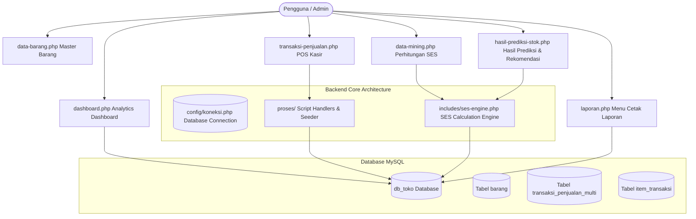
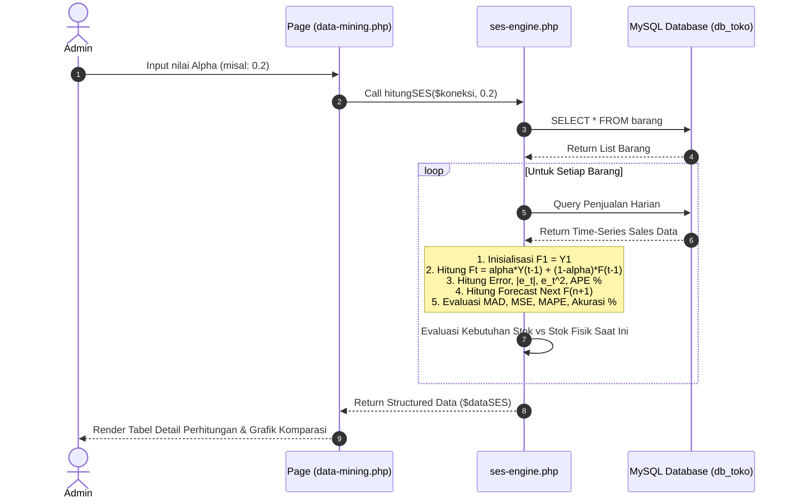
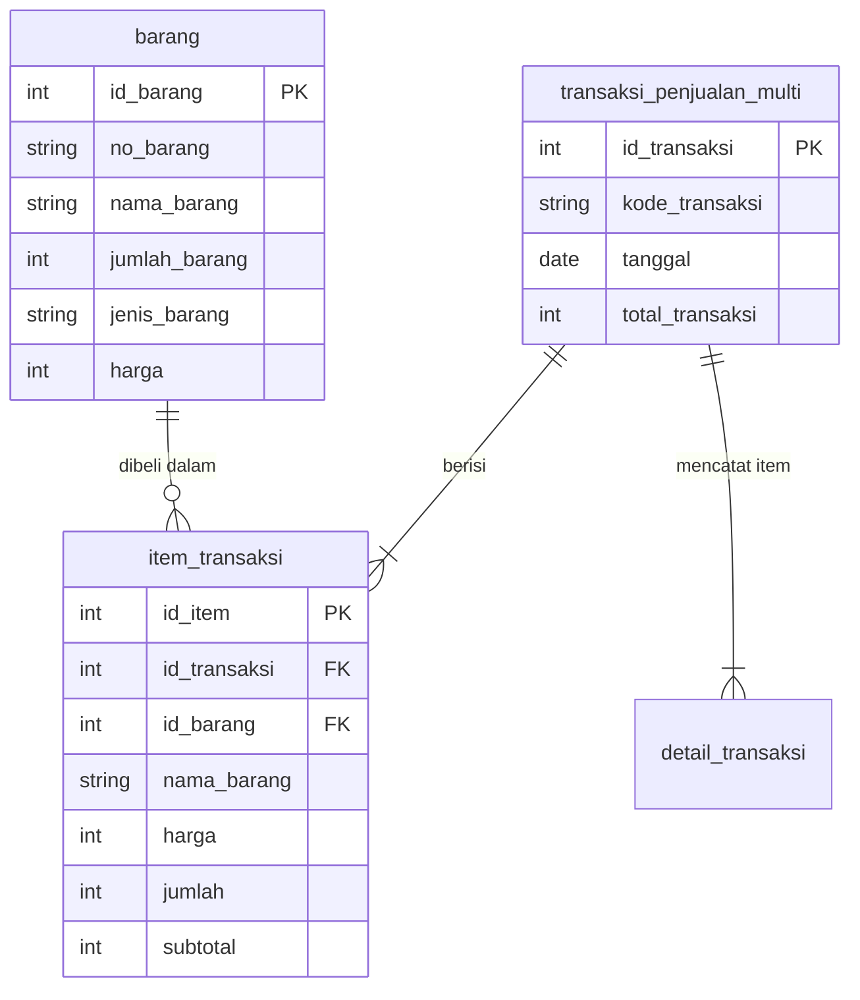

# 📐 Architecture & Data Flow Diagrams

Berikut adalah diagram alur arsitektur sistem dan algoritma Single Exponential Smoothing (SES) menggunakan format visual **Mermaid**.

---

## 1. System High-Level Architecture

---

## 2. Single Exponential Smoothing (SES) Data Flow

---

## 3. Database Entity Relationship Overview

